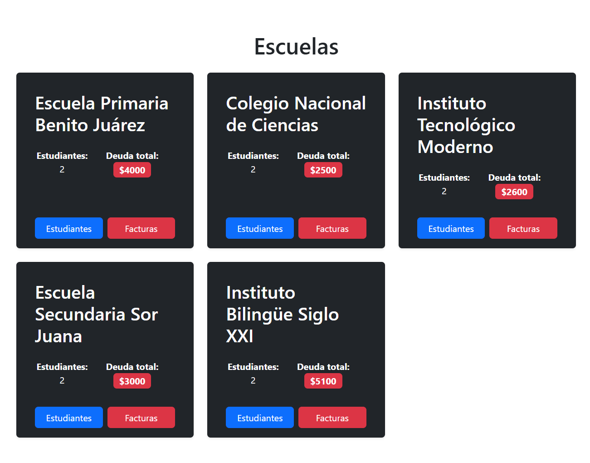
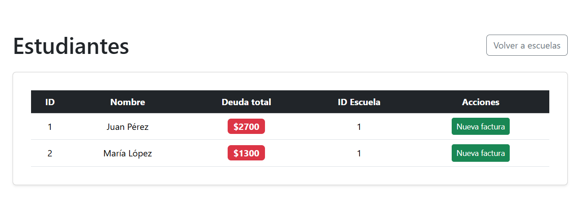
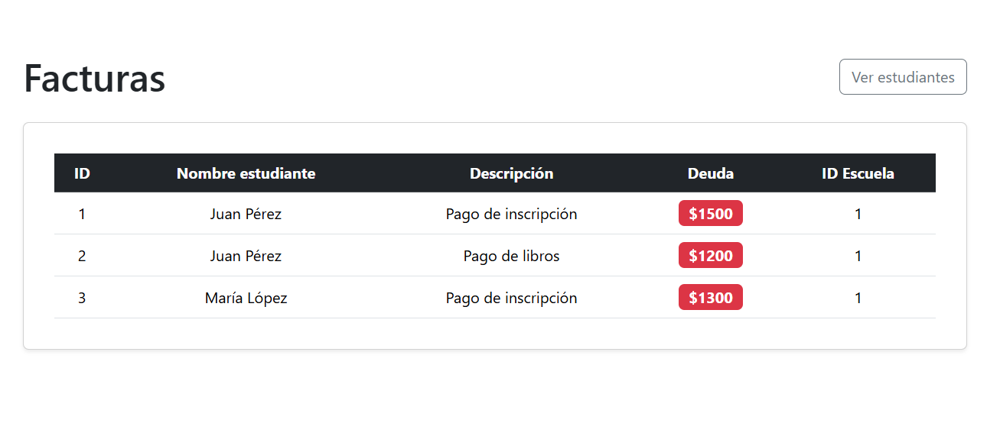
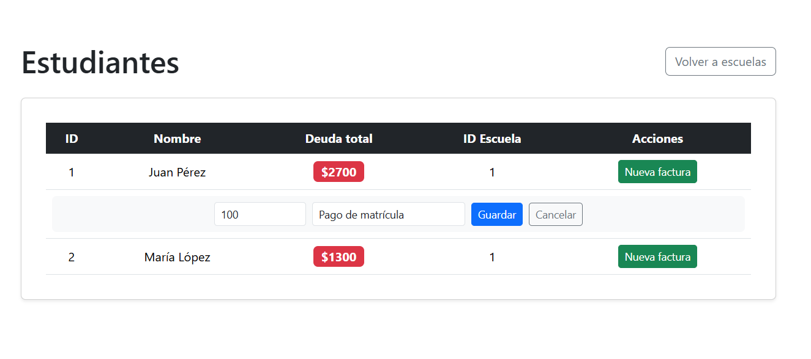

# Mattilda

Mattilda es una aplicación full-stack para la gestión de escuelas, estudiantes y facturas. Incluye un backend FastAPI con SQLModel y un frontend React con Vite.

---

## Imágenes de la aplicación

<div align="center">
  
  <br>
  
  <br>
  
  <br>
  
</div>

---

## Estructura del Proyecto

```
mattilda/
│
├── backend/      # Backend FastAPI + SQLModel
├── frontend/     # Frontend React + Vite
├── images/       # Capturas de pantalla y diagramas
├── docker-compose.yml
└── README.md
```

---

## Cómo ejecutar el proyecto

### Opción 1: Docker Compose (recomendado)

1. Clona el repositorio y entra a la carpeta raíz.
2. Ejecuta:

   ```sh
   docker-compose up --build
   ```

3. El frontend estará en [http://localhost:5173](http://localhost:5173)  
   El backend en [http://localhost:8000](http://localhost:8000)


### Opción 2: Manual

- Consulta el [README del backend](backend/README.md) para instrucciones detalladas del backend.
- Consulta el [README del frontend](frontend/README.md) para instrucciones detalladas del frontend.

---

## Archivos importantes

- `backend/`: Código backend (API, modelos, base de datos, tests).
- `frontend/`: Código frontend (componentes React, estilos).
- `images/`: Imágenes ilustrativas de la app.
- `docker-compose.yml`: Orquestación de servicios para desarrollo y pruebas.

---

## Consejos de desarrollo

- Inicia primero el backend antes que el frontend si no usas Docker.
- Usa terminales separadas para backend y frontend.
- Ejecuta los tests desde la carpeta `backend`.
