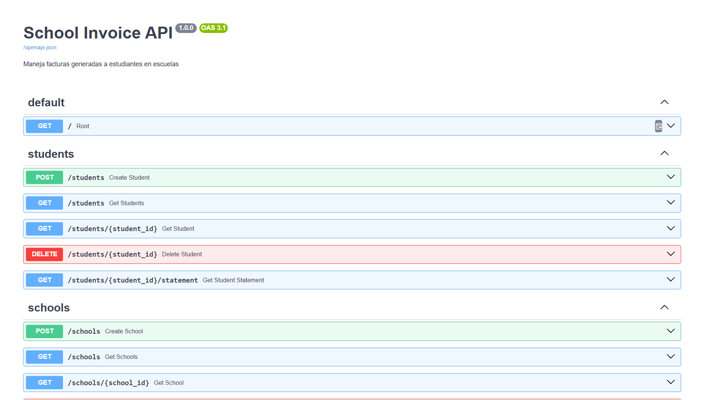

# Backend de Mattilda

Este es el backend de Mattilda, construido con FastAPI y SQLModel.

---

## Imágenes relevantes

<div align="center">
  
</div>

---

## Cómo ejecutar

### Opción 1: Docker Compose

```sh
docker-compose up --build
```

### Opción 2: Manual

1. Crea un entorno virtual y actívalo.
2. Instala dependencias:

   ```sh
   pip install -r requirements.txt
   ```

3. Ejecuta el servidor:

   ```sh
   uvicorn app.main:app --reload
   ```

---

## Archivos y carpetas importantes

- `app/main.py`: Punto de entrada de FastAPI.
- `app/db.py`: Lógica de sesión y creación de base de datos.
- `app/models/`, `app/routes/`, `app/tests/`
- `populate_mock_data.py`: Script para poblar la base de datos con datos de ejemplo.

---

## Ejecutar tests

```sh
pytest
```